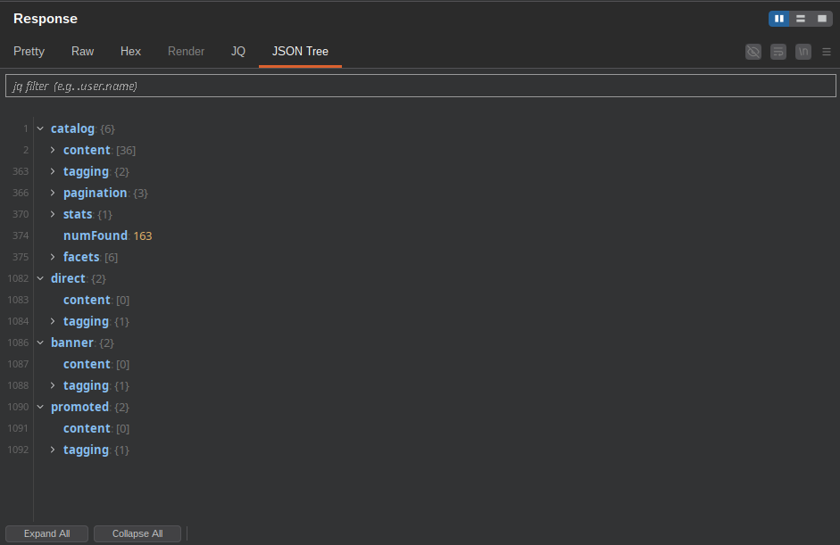
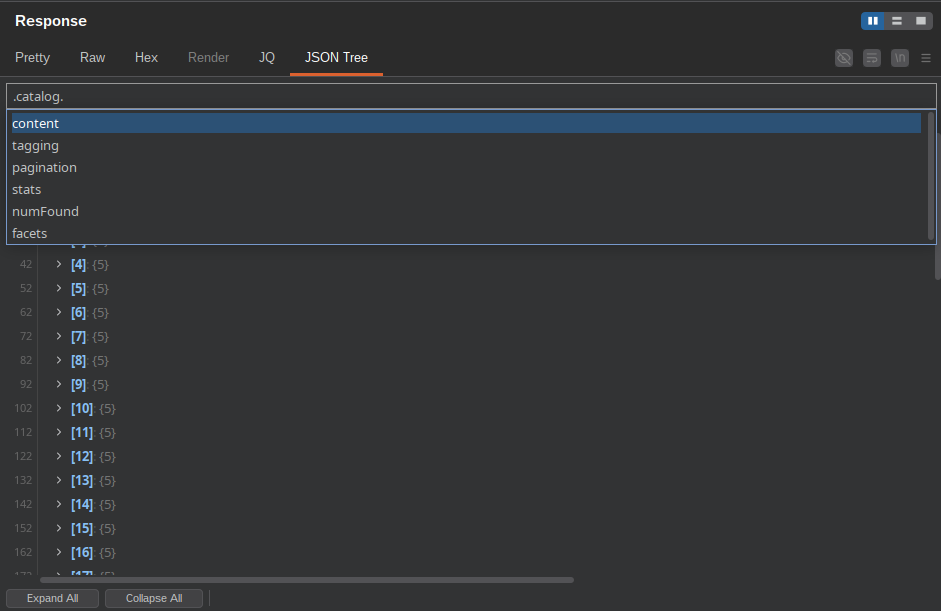
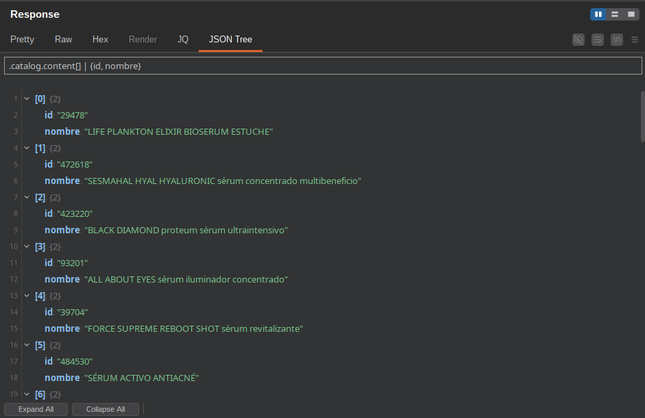
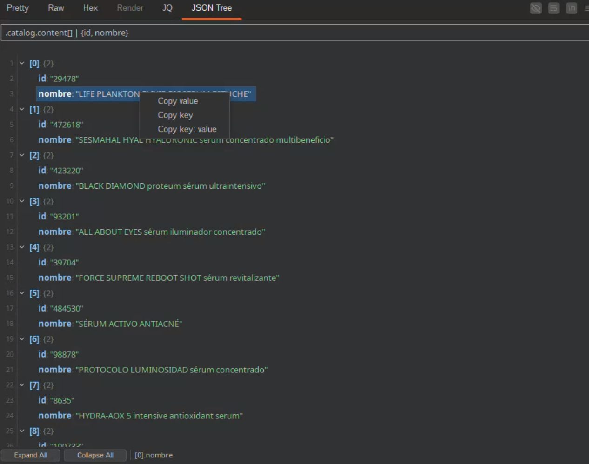

# JSON Tree — Burp Suite Extension

A Burp Suite extension that renders JSON HTTP responses as an interactive, collapsible tree with a **jq-powered search bar**.

## Features

- **Collapsible tree view** — automatically activates on any JSON response (`Content-Type: application/json`)
- **Absolute line numbers** — stable gutter numbers that don't shift when nodes are expanded or collapsed
- **Syntax coloring** — keys, values, arrays, and objects are color-coded; adapts live to Burp's dark/light theme
- **jq filter bar** — query your JSON in real time with full jq syntax (debounced, no Run button needed)
- **Autocomplete** — field suggestions drop down as you type, derived from the current JSON structure
- **Right-click context menu** — Copy value / Copy key / Copy key: value on any node
- **Expand All / Collapse All** buttons
- **Status bar** — shows the jq path of the selected node (e.g. `.user.name`)

## Screenshots

### Main view



The JSON response is rendered as a collapsible tree. Keys are highlighted in blue, array/object sizes are shown inline (`{6}`, `[36]`), and absolute line numbers appear in the gutter.

### jq autocomplete



Typing a path in the filter bar (e.g. `.catalog.`) triggers an autocomplete dropdown listing the matching field names in the current response.

### jq query results



A full jq expression like `.catalog.content[] | {id, nombre}` filters the tree in real time, showing only the projected fields from each array item.

### Right-click context menu



Right-clicking any node exposes **Copy value**, **Copy key**, and **Copy key: value** options. `Ctrl+C` copies `key: value` of the selected node directly.

## Installation

1. Build the fat JAR:
   ```bash
   ./gradlew build
   ```
2. In Burp Suite, go to **Extensions > Installed > Add**.
3. Set **Extension type** to `Java` and select `build/libs/extension-template-project.jar`.
4. The **JSON Tree** tab will appear automatically on every JSON response.

## Requirements

- Burp Suite (Community or Pro)
- Java 21+

## Dependencies

| Library | Purpose |
|---|---|
| `montoya-api` | Burp Suite Montoya API |
| `jackson-databind` | JSON parsing |
| `jackson-jq` + `jackson-jq-extra` | Pure-Java jq engine (no binary required) |

All dependencies are bundled in the fat JAR — no extra setup needed.

## Usage

Open any JSON response in Burp's HTTP history or Repeater, then click the **JSON Tree** tab.

| Action | How |
|---|---|
| Expand / collapse a node | Click the arrow or double-click the row |
| Filter with jq | Type a jq expression in the top bar (e.g. `.user.name`, `.items[] \| .id`) |
| Accept autocomplete suggestion | Click the suggestion or press Enter |
| Copy a value | Right-click a node → **Copy value** |
| Copy `key: value` | Right-click → **Copy key: value**, or select the node and press `Ctrl+C` |
| Expand / collapse all | Buttons at the bottom of the panel |

## Build

```bash
./gradlew build     # compile, test, package
./gradlew jar       # fat JAR only → build/libs/
./gradlew clean     # remove build artifacts
```
